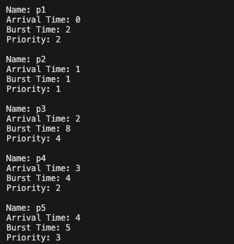
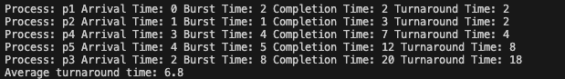
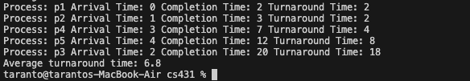
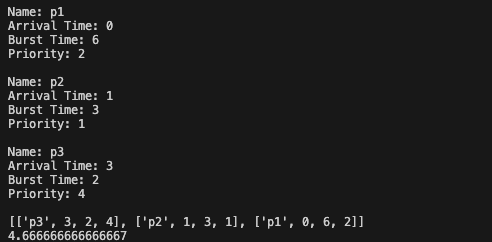

# Jordan Taranto
#### Homework 1
#### CS431
### Github: https://github.com/Jordinaa/cs431/tree/main/homework-1
# Section 1 - Code Implementation
### Main.py
``` main.py
from Input import ProcessCSV
from Scheduling import Scheduling

# Global variables change input file name here
FILE_PATH = "homework-1/test/input.csv"

if __name__ == "__main__":
	# read in CSV file
	data = ProcessCSV(FILE_PATH)
	# get list of processes
	processes = data.return_processes()
	# print out each process
	data.print_processes()
	
	# shortest job first
	sjf = Scheduling(processes)
	sjf_att = sjf.shortest_job_first()
	print(f"Average turnaround time: {sjf_att}")
	print(sjf.sjf_turnaround_time)
	
	# shortest remaining time first
	srt = Scheduling(processes)
	srt_att = srt.shortest_remaining_time()
	print(f"Average turnaround time: {srt_att}")
	print(srt.srt_turnaround_time)
```
### Input.py
```Input.py
import csv 
# reference is from an older project of mine
# https://github.com/Jordinaa/supervisor/blob/master/scripts/fesupervisor.py

class ProcessCSV: 
    def __init__(self, file_path):
        self.file_path = file_path
        self.processes_list = []
        self.read_input()

    # input CSV file read data and assign to class attributes and append to list of processes
    def read_input(self):
        self.csv_file = open(self.file_path, 'r')
        with self.csv_file as file:
            reader = csv.reader(file)
            # skips the header row in CSV
            next(reader)
            for row in reader:
                # read each row in the csv and assign to class attributes
                self.process_name = row[0]
                self.arrival_time = int(row[1])
                self.burst_time = int(row[2])
                self.priority = int(row[3])
                # appends data from csv to the list of processes (orginally had a process object but changed to list for simplicity)
                self.processes_list.append([self.process_name, self.arrival_time, self.burst_time, self.priority])
        # close the csv file 
        self.csv_file.close()

    # returns the list of processes
    def return_processes(self):
        return self.processes_list

    # prints the list of processes (for troubleshooting)
    def print_processes(self):
        for process in self.processes_list:
            print(f"Name: {process[0]}\nArrival Time: {process[1]}\nBurst Time: {process[2]}\nPriority: {process[3]}\n")
```
### Scheduling.py
```Scheduling.py
class Scheduling:
    def __init__(self, list_of_processes):
        self.processes = list_of_processes
        self.process_length = len(self.processes)

    def shortest_job_first(self):
        current_time = 0
        total_turnaround_time = 0
        # sort processes by arrival time first 
        # https://stackoverflow.com/questions/4174941/how-to-sort-a-list-of-lists-by-a-specific-index-of-the-inner-list
        processes = sorted(self.processes, key=lambda arrival_time: arrival_time[1])

        while processes:
            # get the next available process based on current time (0 for first loop)
            available_processes = [process for process in processes if process[1] <= current_time]
            # if no process available at current time increment current time
            if not available_processes:
                current_time += 1
                continue
            
            # now sort the available processes by burst time
            # used min since this simply grabs the process with the shortest burst time (the loop above sorts the whole list by arrival time)
            process_queue = min(available_processes, key=lambda burst_time: burst_time[2])

            # remove from the process from the list
            processes.remove(process_queue)
            arrival_time = process_queue[1]
            burst_time = process_queue[2]
            completion_time = current_time + burst_time
            turnaround_time = completion_time - arrival_time
            total_turnaround_time += turnaround_time
            print(f"Process: {process_queue[0]} Arrival Time: {arrival_time} Burst Time: {burst_time} Completion Time: {completion_time} Turnaround Time: {turnaround_time}")

            # adds to current time since burst time is the time it takes to complete the process 
            current_time += burst_time

        # calculate the average turnaround time 
        average_turnaround_time = total_turnaround_time / self.process_length
        return average_turnaround_time

    def shortest_remaining_time(self):
        # Same as above so copied contents from SJT function and modified it
        current_time = 0
        total_turnaround_time = 0
        processes = sorted(self.processes, key=lambda arrival_time: arrival_time[1])
    
        while processes:
            # almost the same as above but I have another condition where it is comparing the burst time of the process
            available_processes = [process for process in processes if process[1] <= current_time and process[2] > 0]
            if not available_processes:
                current_time += 1
                continue
            process_queue = min(available_processes, key=lambda burst_time: burst_time[2])

            # subtracting burst time directly from the process list not recommended (i would have a process class)
            # this is the preemptive part which helps determine shortest remaining time 
            process_queue[2] -= 1
            if process_queue[2] == 0:
                processes.remove(process_queue)
                arrival_time = process_queue[1]
                completion_time = current_time + 1
                turnaround_time = completion_time - arrival_time
                total_turnaround_time += turnaround_time
                print(f"Process: {process_queue[0]} Arrival Time: {arrival_time} Completion Time: {completion_time} Turnaround Time: {turnaround_time}")
            
            # increment current time
            current_time += 1
    
        average_turnaround_time = total_turnaround_time / self.process_length
        return average_turnaround_time
```
# Section 2 - Outputs
###  Inputs.py
Here is my first file `Inputs.py` with class `ProcessCSV` which is responsible for importing the CSV file.



### Scheduling.py
Here is my second file is `Scheduling.py` with class `Scheduling` this includes **shortest job first** output 



**shortest time remaining** output



# Section 3 - Implementation Details
### Thought Process/Challenges:
My first question going into this was how am I going to manage my data. When I import the CSV how am I going to hold onto that data until the end of the program, what kind of data structure am I going to use. I started with two classes for keeping track of my data ([git commit](https://github.com/Jordinaa/cs431/commit/961cdbe5d69de94bb0fcbeb7a8e18cbe69034f59) near the bottom of the page):
1. class `ProcessCSV` which reads in the CSV file
2. class `Process` which stores my my processes has objects 
The issues I came across was composition vs. inheritance. Because when I appended my data from my CSV I immediately instantiated my Process class and appended the objects to a list like so `self.processes.append(Process(process_name, arrival_time, burst_time, priority))` and, well this just didn't sit right with me for some reason (lack of sleep) so I decided not to do it since this is a CSV file not a live data stream. So I kept it "simple/r" and stuck with a single ProcessCSV class returning a list of lists. 

The second thought I had was my `main.py` file. Do I want to have loops and variable inside of `main.py` file or do I want to just keep a lot of my logic inside a method. I chose to keep it inside the method because I hate the messy look of a `main.py` file. 

The third was my `Scheduling.py` how am I going to write my algorithms. Do I want each one to have its own class? or do I want to keep it inside of one class. Since they are similar algorithms I thought Id try writing two separate methods and have a sort of "helper" function that would dictate the preemptive vs. non-preemptive aspect. Has I was writing this I kept getting stuck on the burst time and changing the data of a list that was being used within the class by two different methods. So I decided to just make them two seperate methods and dropping the "helper" functions all together. 

Here is one [issue](https://github.com/Jordinaa/cs431/commit/963968ca4ad358a0501056f2aa4ed28ba9a55e77) in particular that I couldn't figure out for a bit. Here is the output 
The data being used for this test was taken from the powerpoint in class **Section 3.2 slide 20** it gave me three inputs and the average turnaround time for each algorithm, so I had something to compare my output to. I started out using a "for loop" but before it entered the for loop I sorted the list by burst time. This meant that the first process that would arrive might not have the fastest burst time so I would process them in the wrong order. So thats when I switched to a while loop and decided it would be better to just have Python do the work for me. Before entering the loop I sorted the list by arrival time `processes = sorted(self.processes, key=lambda arrival_time: arrival_time[1])`
that way when it entered the loop it would have something in the queue. After that, then I would start pulling the min burst time `process_queue = min(available_processes, key=lambda burst_time: burst_time[2])`. 
### Insight
I should have made a `class Process` to store all of my data in. I brought it up earlier and decided against it but **if** I wanted to scale this up or move onto a live datastream, I think it would have had many uses. Such as processing the previous and present object in real time, and having the rest drop off. Hell, maybe even estimate the future state of a PC (Numerical methods anyone??) no idea how that would work. It just what I have done in the past with drones and aircrafts. 

I would also utilized my `main.py` the trade-off was that my `Scheduling.py` file looks disgusting and my `main.py` file is practically empty. 

Was a fun assignment I will start the next one sooner, I learned a lot. 